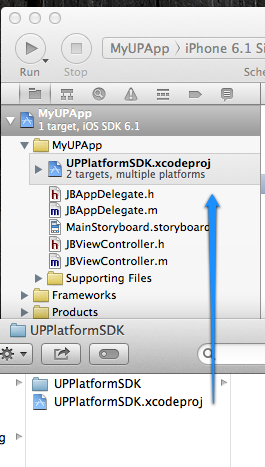
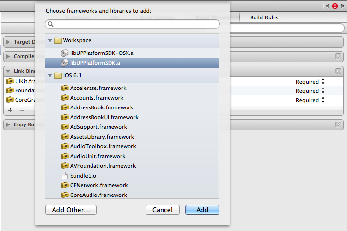
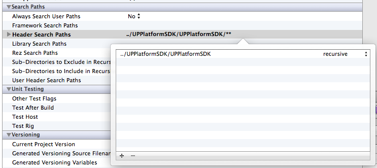
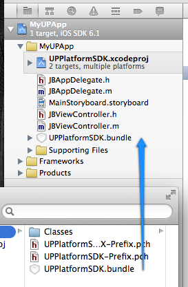

# UP Platform iOS/OS X SDK

---

## Overview

This SDK provides an Objective-C interface for integrating iOS and Mac OS X apps with the [UP Platform](https://jawbone.com/up/platform). It handles authentication using OAuth 2.0 via a UIWebView and provides simple interfaces for making requests to the platform's REST endpoints.

## Table of Contents

- [Requirements](#requirements)
- [Getting Started](#getting-started)
  - [Setting up Your Environment](#setting-up-your-environment)
  - [Getting the Jawbone iOS SDK](#getting-the-jawbone-ios-sdk)
  - [Running the Sample App](#running-the-sample-app)
- [Documentation](#documentation)
- [Demo Application](#demo-application)
- [Credits](#credits)
- [License](#license)

## Getting Started

#### 1. Setting up Your environment

The SDK needs OS X Mavericks https://itunes.apple.com/us/app/os-x-mavericks/id675248567?mt=12# and Xcode 5. http://itunes.apple.com/us/app/xcode/id497799835?ls=1&mt=12

#### 2. Getting the Jawbone iOS SDK.

Clone the repository `git clone git@github.com:Jawbone/UPPlatformSDK.git`.
Or download the latest release.

#### 3. Running the Sample App.

MealKeywordsSample

## Installation

* Drag `UPPlatformSDK.xcodeproj` into your own xcode project or workspace.



* Under Build Phases, add either `libUPPlatformSDK.a` or `libUPPlatformSDK-OSX.a` to the linked libraries, depending on your platform.



* Under Build Settings, add the UPPlatformSDK (i.e. `../UPPlatformSDK/UPPlatformSDK`) directory to the Header Search Paths recursively.



* Under Build Settings, add `-all_load` to Other Linker Flags.


* Drag `UPPlatformSDK.bundle` into your project's resources.



## Authentication

Authentication is handled using the shared `UPPlatform` object.

First, to validate that an existing session is still valid, call `validateSessionWithCompletion:`. If the `session` object passed to the completion block is not `nil`, the session is valid and API requests can be made.

*NOTE: I only added this because when requesting tokens from multiple clients (i.e. Simulator and iPhone), the previously requested tokens become invalid. We should fix this.*

To start a new session, using the `startSessionWithClientID:clientSecret:authScope:completion:` method.

	[[UPPlatform sharedPlatform] startSessionWithClientID:@"MY_CLIENT_ID" clientSecret:@"MY_CLIENT_SECRET" authScope:(UPPlatformAuthScopeExtendedRead | UPPlatformAuthScopeMoveRead) completion:^(UPSession *session, NSError *error) {
		// If session != nil we can begin making API requests.
	}];
	
See `UPPlatform.h` for all available authScopes.

## API Requests

Once a valid session has been established, there are a few ways to create API requests. You can use either the provided objects that encapsulate most of the available endpoints, or you can create custom requests.

### API Objects

The API Objects are the simplest way to create requests to the REST platform. They take creating the network requests and parsing the resulting JSON into `NSObject`s. Here are a few examples:

##### Get the current user's information

	[UPUserAPI getCurrentUserWithCompletion:^(UPUser *user, UPURLResponse *response, NSError *error) {
		// Do something with the user
	}];
	
##### Get the user's past 14 moves

	[UPMoveAPI getMovesWithLimit:14 completion:^(NSArray *results, UPURLResponse *response, NSError *error) {
		// Do something with the array of UPMove objects
	}];
	
##### Post a new body event to UP

	UPBodyEvent *bodyEvent = [UPBodyEvent eventWithTitle:@"160 lbs." weight:@(72.5748) bodyFat:@(20) leanMass:@(20) bmi:@(22) note:@"Weigh-in created by My App." image:nil];
	
	[UPBodyEventAPI bodyEvent completion:^(UPBodyEvent *event, UPURLResponse *response, NSError *error) {
		// Event was created and updated with an xid
	}];
	
*Note: All units (weight, distance) are in metric.*

### Custom Requests

Custom API Requests can also be made using the `UPURLRequest` object, which is what the API Objects also use. This allows you to make a request to any endpoint, giving any parameters, and receiving a resulting JSON object. Here are a few examples:

##### Get the current user's information

	UPURLRequest *request = [UPURLRequest getRequestWithEndpoint:@"nudge/api/users/@me" params:nil];
	
    [[UPPlatform sharedPlatform] sendRequest:request completion:^(UPURLRequest *request, UPURLResponse *response, NSError *error) {
        // The resulting response.data is an NSDictionary with the JSON results
    }];
    
##### Post a new mood to UP

	NSDictionary *params = @{ @"title" : @"I feel great!", @"sub_type" : @(1), @"tz" : [NSTimeZone localTimeZone].name };
	
	UPURLRequest *request = [UPURLRequest postRequestWithEndpoint:@"nudge/api/users/@me/mood" params:params];
	
	[[UPPlatform sharedPlatform] sendRequest:request completion:^(UPURLRequest *request, UPURLResponse *response, NSError *error) {
		// The resulting response.data is an NSDictionary describing the created mood
	}];
	
## Additional Resources

You can find additional documentation at <https://jawbone.com/up/platform>.

# Documentation

## User Information

### Get detailed information about the user
### Get list of friends (identifiers)
### Get the user's current mood
### Get the user's trends

## Moves

### Get the user's move list (paginated by date or by a timestamp).

``` objective-c
[UPMoveAPI getMovesWithLimit:10U completion:^(NSArray *moves, UPURLResponse *response, NSError *error) {
	// Your code here to process an array of UPMove objects.
}];
```

### Get the information about a specific move.

``` objective-c
// TODO: What is the code here?
```

### Get the user's move graphs.

``` objective-c
[UPMoveAPI getMoveGraphImage:move completion:^(UIImage *image) {
	// Your code here to process the graph image.
}];
```

### Get move intensity.

``` objective-c
TODO: How do you do this in code?
```

## Workouts

### Get the user's workout list (paginated by date or by a timestamp).

``` objective-c
[UPWorkoutAPI getWorkoutsWithLimit:10U completion:^(NSArray *workouts, UPURLResponse *response, NSError *error) {
	// Your code here to process an array of UPWorkout objects.
}];
```

### Create a new workout.

We can start by creating a new workout event.

``` objective-c
UPWorkout *workout = [UPWorkout workoutWithType:UPWorkoutTypeBike
                                      startTime:startTime
                                        endTime:endTime
                                      intensity:UPWorkoutIntensityEasy
                                 caloriesBurned:@300];
                                 
workout.distance = @7;
workout.imageURL = @"http://jaredsurnamer.files.wordpress.com/2011/11/116223-magic-marker-icon-sports-hobbies-people-man-runner.png";
```

We can then post this workout event to the user's feed.

``` objective-c
[UPWorkoutAPI postWorkout:workout completion:^(UPWorkout *workout, UPURLResponse *response, NSError *error) {
	// Your completion code here.
}];
```

### Get the user's workout graphs.

``` objective-c
[UPWorkoutAPI getWorkoutGraphImage:workout completion:^(UIImage *image) {
	// Your code here to use the graph image.
}];
```

### Get workout intensity.

``` objective-c
TODO: What is the code here?
```

## Sleeps

### Get the user's recent sleep events.

``` objective-c
[UPSleepAPI getSleepsWithLimit:10U completion:^(NSArray *sleeps, UPURLResponse *response, NSError *error) {
	// Your code here to process an array of UISleep objects.
}];
```

### Get the information about a specific sleep event.

``` objective-c
// TODO: What is the code here?
```

### Get the user's sleep graphs.

``` objective-c
[UPSleepAPI getSleepGraphImage:sleep completion:^(UIImage *image) {
	// Your code here to handle the graph image.
}];
```

### Get sleep phases.

``` objective-c
// TODO: What is the code here?
```

## Meals

### Get the user's recent meal events.

``` objective-c
[UPMealAPI getMealsWithLimit:5U completion:^(NSArray *meals, UPURLResponse *response, NSError *error) {
	// Your code here to process the meals array.
}];
```

### Create a new meal

Meal events should be created with one or more meal items. To create a new meal event, we start by specifying nutritional information for a single meal item.

``` objective-c
UPMealNutritionInfo *info = [[UPMealNutritionInfo alloc] init];

info.calories = @130;
info.sugar = @30;
info.carbohydrates = @10;
info.calcium = @80;
```

Afterwards, we create a new meal item and set its nutritional information.
	
``` objective-c
UPMealItem *item = [UPMealItem mealItemWithName:@"Granola Bar" 
                                    description:@"A fancy granola bar."
                                         amount:@1 
                               measurementUnits:@"bar"
                                    servingType:UPMealItemServingTypePlate 
                                       foodType:UPMealItemFoodTypeBrand 
                                 nutritionInfo:info];
```

Then, we create a new meal event that will hold the meal item we had just created.

``` objective-c
UPMeal *meal = [UPMeal mealWithTitle:@"Delicious Granola Bar"
                                note:@"It was tasty" 
                               items:@[item]];
                               
meal.photoURL = @"http://studylogic.net/wp-content/uploads/2013/01/burger.jpg";
```

Finally, let's post a new event on the user's feed with our new meal!

``` objective-c	
[UPMealAPI postMeal:meal completion:^(UPMeal *meal, UPURLResponse *response, NSError *error) {
	// Your code here to process the meal object.
}];
```

### Get the information about a specific meal.

``` objective-c
[UPMealAPI getMealDetails:meal completion:^(UPMeal *meal, UPURLResponse *response, NSError *error) {
	// Your code here to process the meal object.
}];
```

## Body Composition

### Record body weight, BMI, lean mass, and body fat.
### Retrieve user records of body weight, BMI, lean mass, and body fat.
### Get a single body composition record event.
### Delete body composition record event.

## Cardiac Metrics

### Record heart rate and blood pressure.
### Retrieve heart rate and blood pressure records.
### Get a single cardiac metric record event.
### Delete cardiac metric record event.

## Generic Events

### Create a new event that will show in the user's feed.

## Mood 

### Record the user's mood.
### Get the user's mood.
### Get a mood event.
### Delete mood event.

# Object Types

## User
## Meal
## Move
## Workout
## Sleep
## Mood
## Generic
## Cardiac
## Weight
## User Metrics
## Trends
## Timezone
